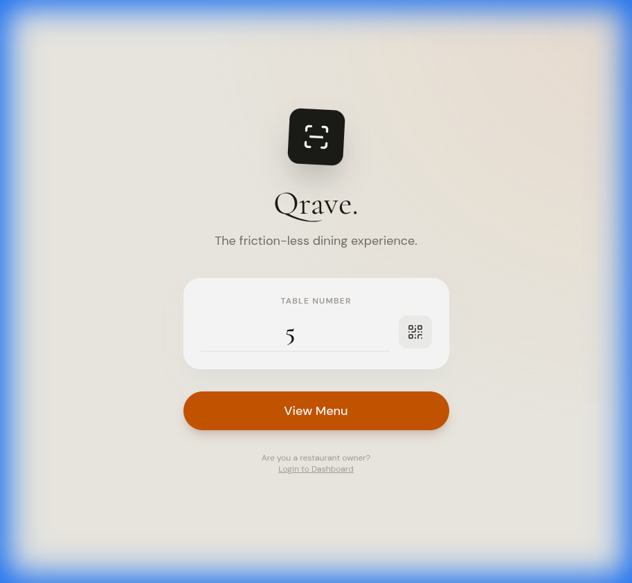
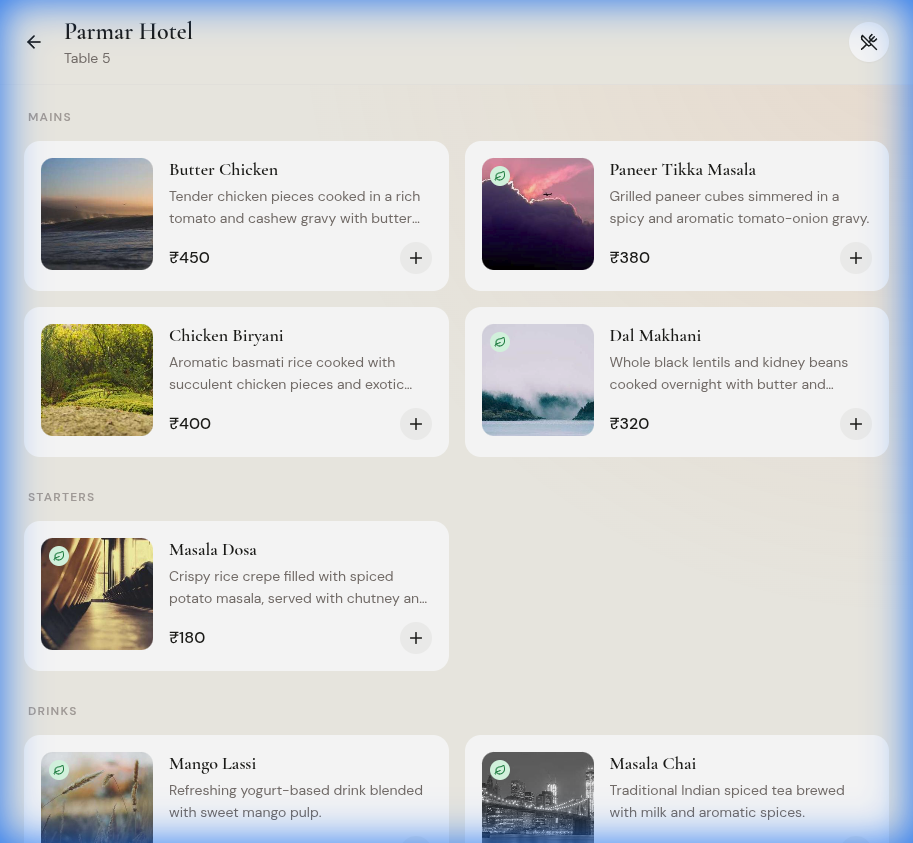
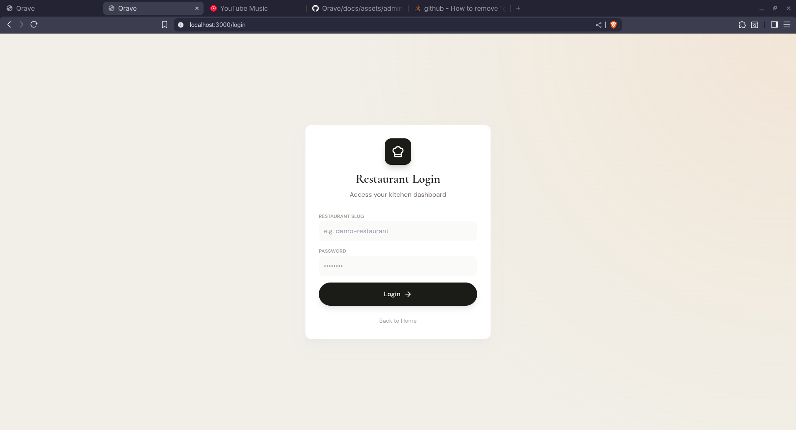

# Qrave – Modern Dine-In Experience 🍽️



> **A sleek, full-stack restaurant application** that redefines the dine-in experience. Customers browse menus, place orders, and track them in real-time—all through a stunning, mobile-first interface. Powered by a robust **local SQLite + Express backend** and a **React Vite frontend**.

---

## ✨ Features

### 📱 For Customers
- **Interactive Menu**: Browse dishes with beautiful visuals and detailed descriptions.
- **Real-Time Tracking**: Watch your order status update live from "Pending" to "Served".
- **Seamless Checkout**: Easy cart management and order placement.
- **Mobile-First Design**: Optimized for any device with glassmorphism aesthetics and smooth animations.

### 👨‍🍳 For Restaurants (Admin)
- **Dynamic Dashboard**: Manage orders and menu items effortlessly.
- **Live Order Management**: Accept, prepare, and serve orders with a single click.
- **Menu Control**: Add, edit, or remove dishes instantly.
- **Printable Invoices**: Generate professional, tax-ready receipts.

---

## 📸 See it in Action

### Customer Menu
Browse a rich, visual menu with category filtering and instant search.


### Admin Dashboard
*Manage your restaurant's operations from a centralized hub.*


---

## 🛠️ Tech Stack

| Layer | Technology |
|-------|------------|
| **Frontend** | React 18, Vite, TypeScript, Lucide React, Framer Motion |
| **Backend** | Express 5, TypeScript, Prisma ORM |
| **Database** | SQLite (Local file-based) |
| **Styling** | Modern CSS (Glassmorphism, Dark Mode, Gradients) |

---

## 🚀 Getting Started

Follow these steps to get Qrave running locally in minutes.

### Prerequisites
- **Node.js** ≥ 20
- **npm** (included with Node)

### Installation

1. **Clone the repository**
   ```bash
   git clone https://github.com/YuvrajS01/Qrave.git
   cd Qrave
   ```

2. **Install dependencies**
   ```bash
   npm install
   ```

3. **Configure Environment**
   Create a `.env` file in the root directory:
   ```env
   # Server
   PORT=3001
   DATABASE_URL=file:./prisma/dev.db

   # Frontend
   VITE_API_URL=http://localhost:3001/api
   ```

4. **Initialize Database**
   ```bash
   # Generate Prisma client and push schema
   npx prisma generate
   npx prisma db push

   # Seed demo data
   npx tsx prisma/seed.ts
   ```

### Running the App

You can run both the backend and frontend with a single command (if configured) or separately:

**Backend (Express)**
```bash
npm run server
```

**Frontend (Vite)**
```bash
npm run dev
```

- **Customer App**: [http://localhost:5173](http://localhost:5173)
- **Admin Dashboard**: [http://localhost:5173/admin](http://localhost:5173/admin)

> **Note**: Default Admin Credentials
> - **Slug**: `demo-restaurant`
> - **Password**: `password`

---

## 📜 Scripts

| Script | Description |
|--------|-------------|
| `npm run dev` | Starts the Vite development server |
| `npm run server` | Starts the Express backend with watch mode |
| `npm run build` | Builds the frontend for production |
| `npm run preview` | Previews the production build |

---

## 🤝 Contributing

Contributions are welcome! Please follow these steps:
1. Fork the project.
2. Create your feature branch (`git checkout -b feature/AmazingFeature`).
3. Commit your changes (`git commit -m 'Add some AmazingFeature'`).
4. Push to the branch (`git push origin feature/AmazingFeature`).
5. Open a Pull Request.

---

## 📄 License

Distributed under the MIT License. See `LICENSE` for more information.

---

*Built with ❤️ by Yuvraj S.*